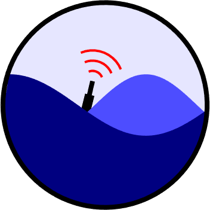

	<b>PyAXBPS- A Python package for the Airborne eXpendable Buoy Processing System (AXBPS)</b>
	   
  

## Overview 

PyAXBPS includes classes that enable reprocessing the following air-launched single-use probes from raw audio (WAV) files:

* Airborne eXpendable BathyThermograph (AXBTs)
* Airborne eXpendable Conductivity-Temperature-Depth (AXCTDs)
* Airborne eXpendable Current Profiler (AXCPs) 

Additionally, PyAXBPS includes fileinteraction, with functions that allow users to save profile data in a variety of common formats (including .DTA, .edf, and .nvo).

### Examples:

Example code using PyAXBPS to reprocess data from all three probe types and save the processed profiles in a variety of file formats is included in the example.py file.

	
### Installation Dependencies:
The recommended method for installation is via pip:
`pip install PyAXBPS`

If you would prefer to clone this repository and install manually, follow the steps below:

1. `git clone https://github.com/cdens/PyAXBPS`
2. `pip install -e PyAXBPS`

## Additional Information

To download the windows installer for the AXBPS program (with GUI), capable of supporting realtime processing or audio reprocessing of AXBT, AXCTD, and AXCP profiles, as well as temperature, salinity, and current profile quality control and a variety of import and export file formats, visit http://mmmfire.whoi.edu/axbps/. 
